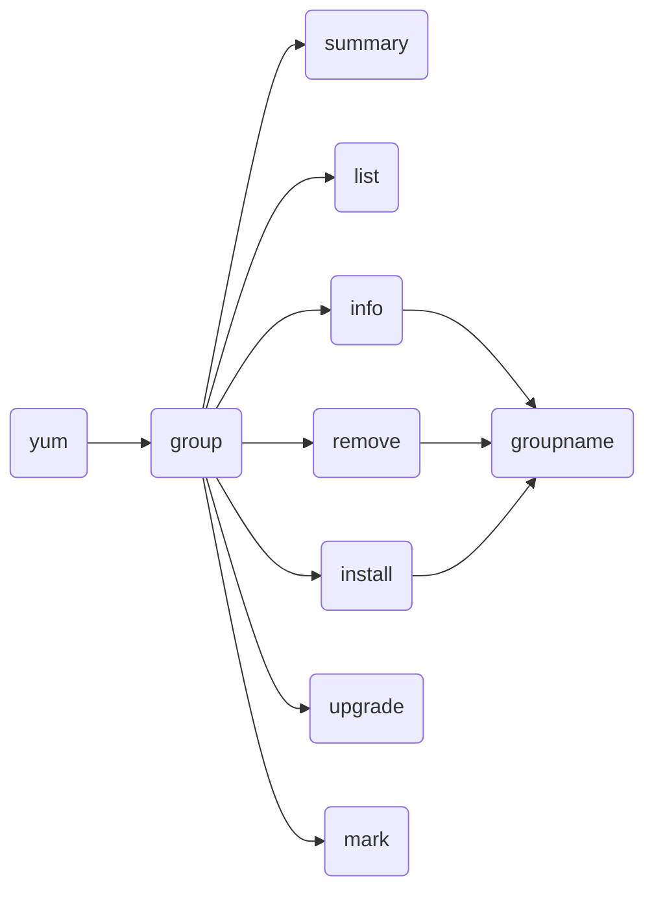

# Yum-101

## Install application with Yum 
Search an application

    yum search application

Install an application

    yum install application

Delete an application

    yum remove application

## Install group of applications
**Available commands:**

Show groups application summary

	yum group

List groups application (installed & availables)

	yum group list

Show a group info

	yum group info groupname

Install a group of application

	yum group install groupname

Delete a group of application

	yum group remove groupname

## Manage Repository

Update Repository List

Update applications

